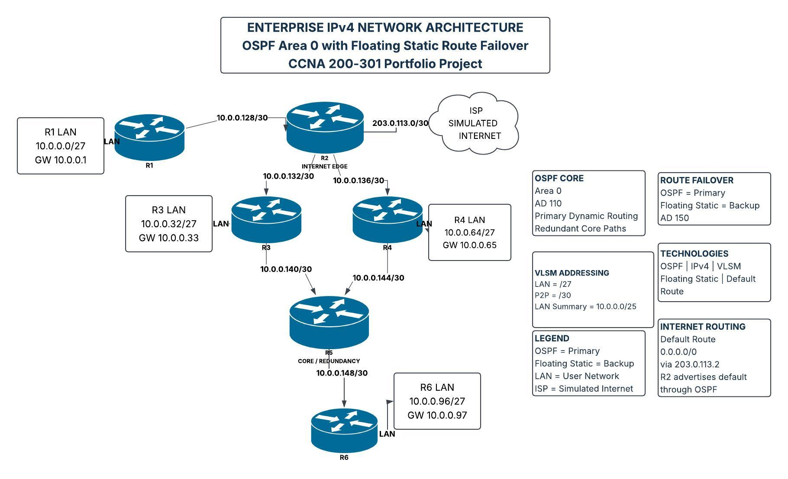
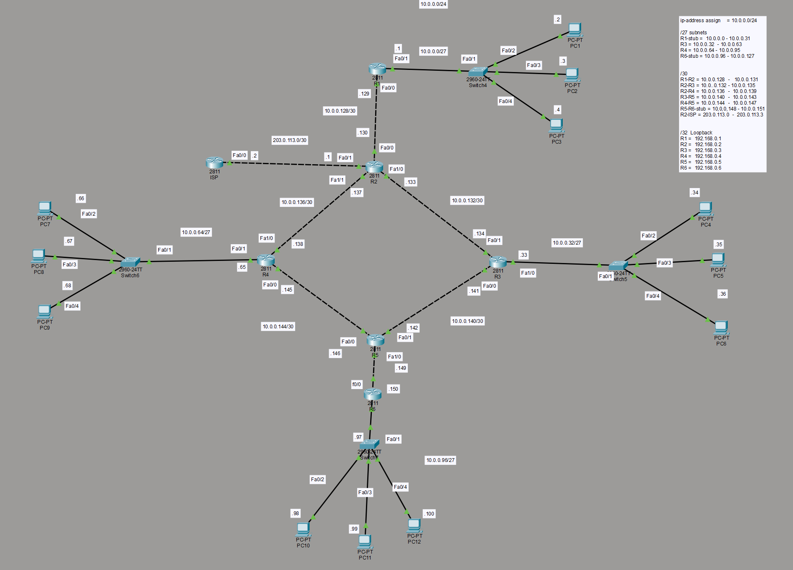
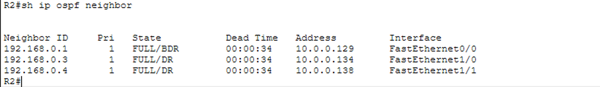
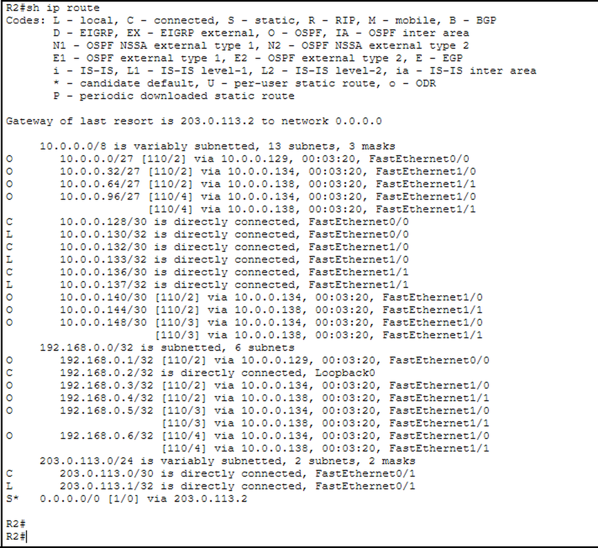
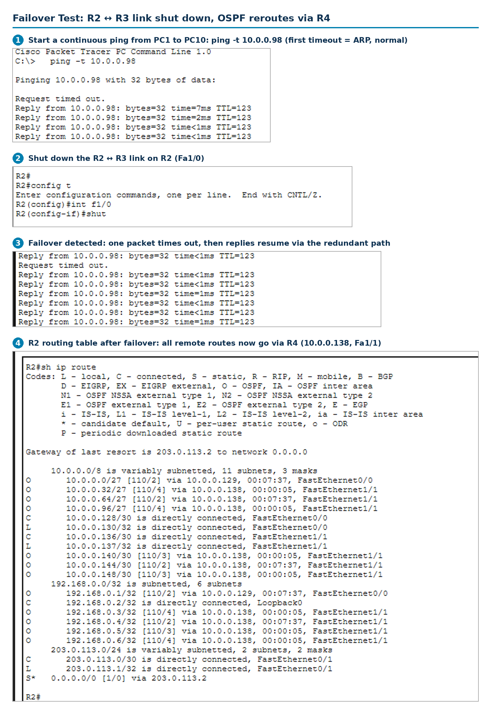

<div align="center">

# 🌐 Enterprise IPv4 Network with OSPF & Automatic Failover

### Designed, addressed, and validated in Cisco Packet Tracer — a CCNA 200-301 portfolio project


| 🖧 Routers | 🏢 User LANs | 💻 Hosts | 🔗 Core paths | ⏱️ Packets lost on link failure |
|:---:|:---:|:---:|:---:|:---:|
| **6 + ISP** | **4** | **12** | **2 redundant** | **1** |

</div>

---

## 📌 Overview

This project simulates a **six-router enterprise network** that connects four user LANs and reaches the internet through a dedicated edge router. It is built the way real enterprise networks are: dynamic routing as the primary mechanism, a **redundant core** so that no single core link is a point of failure, and a **floating static route** as a safety net if dynamic routing is lost.

**The business problem it solves:** keep users connected to each other and to the internet, even when a link or a routing process fails, with a clean, scalable addressing plan that is easy to grow and easy to troubleshoot.

## 🖼️ Network Architecture

<div align="center">



</div>

| Role | Device | Function |
|------|--------|----------|
| Access / LAN router | **R1** | Serves the R1 user LAN, single uplink to the edge router; runs OSPF plus a static backup route |
| **Internet edge** | **R2** | Connects to the simulated ISP, originates the default route into OSPF |
| Distribution | **R3**, **R4** | Two parallel paths between the edge and the core; each serves its own LAN |
| **Core / redundancy** | **R5** | Joins both distribution paths and provides the redundant core |
| Access / LAN router | **R6** | Serves the R6 user LAN, connected through the core; runs OSPF plus a static backup route |
| Simulated internet | **ISP** | Upstream provider reached via `203.0.113.0/30` |

## ✨ Key Features

- **OSPF Area 0 backbone:** fast, automatic route learning and convergence across all routers.
- **Redundant core design:** the R2 → R3/R4 → R5 diamond gives two independent paths, so a single link failure does not isolate the core. Verified in a live failover test (see below).
- **Floating static route backup:** a backup route (AD 150) that stays hidden while OSPF (AD 110) is healthy and activates only if OSPF routes disappear.
- **Efficient VLSM addressing:** `/27` user LANs and `/30` point-to-point links from a single `10.0.0.0/24` block, with no wasted address space.
- **Summarization-ready addressing:** the four user LANs are laid out contiguously, so they aggregate cleanly into `10.0.0.0/25`.
- **Centralized internet access:** R2 owns the default route (`0.0.0.0/0` via `203.0.113.2`) and advertises it through OSPF, so every router follows one consistent exit path.

## 🖥️ Packet Tracer Implementation

The design was fully built and tested in Cisco Packet Tracer: **6 routers, 1 ISP router, 4 switches, and 12 end-user PCs** across four LANs. Every interface, IP address, and subnet in the tables below is visible in this topology.



### Lab Components

| Component | Model | Count |
|-----------|-------|:-----:|
| Routers (R1–R6) | Cisco 2811 | 6 |
| Simulated ISP | Cisco 2811 | 1 |
| Access switches (Switch4–Switch7) | Cisco 2960-24TT | 4 |
| End devices | PC-PT | 12 (3 per LAN) |

### Loopback Interfaces (`/32`, used as OSPF Router IDs)

| Router | Loopback |
|--------|----------|
| R1 | `192.168.0.1` |
| R2 | `192.168.0.2` |
| R3 | `192.168.0.3` |
| R4 | `192.168.0.4` |
| R5 | `192.168.0.5` |
| R6 | `192.168.0.6` |

> R1 and R6 are **normal routers**, configured the same way as R2–R5: each runs OSPF Area 0 and also has a static backup route. The R2 → R3/R4 → R5 core provides the redundancy between them.

## 🧭 IP Addressing Plan

### User LANs (`/27` — 30 usable hosts each)

| LAN | Network | Gateway (Router Interface) | Switch | Hosts |
|-----|---------|----------------------------|--------|-------|
| R1 LAN | `10.0.0.0/27` | `10.0.0.1` (R1 Fa0/1) | Switch4 | PC1 `.2`, PC2 `.3`, PC3 `.4` |
| R3 LAN | `10.0.0.32/27` | `10.0.0.33` (R3 Fa1/0) | Switch5 | PC4 `.34`, PC5 `.35`, PC6 `.36` |
| R4 LAN | `10.0.0.64/27` | `10.0.0.65` (R4 Fa0/1) | Switch6 | PC7 `.66`, PC8 `.67`, PC9 `.68` |
| R6 LAN | `10.0.0.96/27` | `10.0.0.97` (R6 Fa0/1) | Switch7 | PC10 `.98`, PC11 `.99`, PC12 `.100` |

> **LAN summary:** `10.0.0.0/25` covers all four user networks.

### Point-to-Point Links (`/30` — 2 usable hosts each)

| Link | Subnet | Side A | Side B |
|------|--------|--------|--------|
| R1 ↔ R2 | `10.0.0.128/30` | R1 Fa0/0 — `.129` | R2 Fa0/0 — `.130` |
| R2 ↔ R3 | `10.0.0.132/30` | R2 Fa1/0 — `.133` | R3 Fa0/1 — `.134` |
| R2 ↔ R4 | `10.0.0.136/30` | R2 Fa1/1 — `.137` | R4 Fa1/0 — `.138` |
| R3 ↔ R5 | `10.0.0.140/30` | R3 Fa0/0 — `.141` | R5 Fa0/1 — `.142` |
| R4 ↔ R5 | `10.0.0.144/30` | R4 Fa0/0 — `.145` | R5 Fa0/0 — `.146` |
| R5 ↔ R6 | `10.0.0.148/30` | R5 Fa1/0 — `.149` | R6 Fa0/0 — `.150` |
| R2 ↔ ISP (simulated internet) | `203.0.113.0/30` | R2 Fa0/1 — `.1` | ISP Fa0/0 — `.2` |

## 🔁 How the Routing Works

| Layer | Mechanism | Admin Distance | Role |
|-------|-----------|:--------------:|------|
| Primary | **OSPF Area 0** | 110 | Dynamically learns and shares all internal routes |
| Backup | **Floating static route** | 150 | Installed only if the OSPF-learned route is lost |
| Internet | **Default route** `0.0.0.0/0` via `203.0.113.2` | 1 (static) | Configured on R2, advertised to all routers through OSPF |

**Failover logic:** a router always prefers the route with the lowest administrative distance. While OSPF is healthy (110), the static route (150) stays out of the routing table. If OSPF loses the path, the floating static route takes over automatically, with no manual intervention.

## 🛠️ Technologies & Skills Demonstrated

| Area | What this project shows |
|------|-------------------------|
| **Dynamic routing** | OSPFv2 single-area design, neighbor adjacency, route advertisement, equal-cost load balancing |
| **IP addressing** | IPv4 subnetting, **VLSM**, summarization-ready address plan |
| **Network resilience** | Redundant topology design, live failover testing, floating static routes, administrative distance |
| **Internet edge design** | Default routing, default-route propagation through OSPF |
| **Documentation** | Clear topology diagram, interface-level addressing plan, and design rationale |
| **Troubleshooting mindset** | Verification and failover testing methodology (below) |

## 📂 Repository Structure

```
ccna-enterprise-network-ospf/
├── README.md
├── configs/
│   ├── R1.txt … R6.txt                        # cleaned running-config per router
│   └── ISP.txt
├── images/
│   ├── enterprise-network-architecture.jpeg   # design diagram (top of README)
│   ├── packet-tracer-topology.png             # full lab topology
│   ├── ospf-neighbors.png                     # show ip ospf neighbor (R2)
│   ├── routing-table.png                      # show ip route (R2, healthy network)
│   └── failover-test.png                      # failover test, 4 steps
└── packet-tracer/
    └── enterprise-network.pkt
```

## 🚀 How to Run the Lab

1. Install **Cisco Packet Tracer** (free with a Cisco Networking Academy account).
2. Open `packet-tracer/enterprise-network.pkt`.
3. Wait for the links to turn green, then verify using the commands below.

## ⚙️ Configuration

The full running-config for every device is in [`configs/`](configs/), one file per device (`R1.txt` … `R6.txt`, `ISP.txt`). Boilerplate (version, license, spanning-tree) is stripped out so only the routing-relevant parts are shown: interfaces, OSPF, and the floating static backup routes.

Two things worth pointing out:

- **The floating static routes are AD 150 on every router** (R1–R6), confirming the "Backup" row in the routing table above. They point to each router's directly-connected neighbor, so if OSPF ever fails, the router still has a manual path out.
- **R2's default route has no AD specified**, so it uses the default AD of 1 — this is the route `default-information originate` advertises into OSPF for every other router to use.

## ✅ Verification & Testing

Run these on any router to confirm the design behaves as intended:

| Goal | Command | What to look for |
|------|---------|------------------|
| OSPF neighbors formed | `show ip ospf neighbor` | Neighbors in **FULL** state |
| OSPF routes learned | `show ip route ospf` | Routes to all remote LANs marked `O` |
| Default route present | `show ip route` | Gateway of last resort set to `203.0.113.2` |
| End-to-end connectivity | `ping` between LANs (e.g. R1 LAN → R6 LAN) | Successful replies |
| Internet reachability | `ping 203.0.113.2` from any LAN | Successful replies |

### Proof of Operation

**OSPF neighbors in FULL state on R2** (`show ip ospf neighbor`): R2 has adjacencies with R1, R3 and R4, identified by their loopback router IDs.



**Routing table on R2** (`show ip route`): OSPF-learned routes (`O`) to every LAN and loopback, connected links (`C`/`L`), and the static default route (`S*`) to the ISP at `203.0.113.2`. Note the R6 LAN (`10.0.0.96/27`) is reachable over **two equal-cost paths**, one via R3 and one via R4.



### Failover Test (OSPF Redundant-Path Failover)

1. **Start the ping:** on PC1 (R1 LAN), open **Desktop → Command Prompt** and run `ping -t 10.0.0.98` (PC10 in the R6 LAN). The first packet may time out while ARP resolves, which is normal. Wait for steady replies.
2. **Shut the link:** on R2, run `interface fa1/0` → `shutdown` to take down the R2 ↔ R3 link.
3. **Detect the failover:** watch the ping. One packet times out, then replies resume through the redundant path via R4.
4. **Check the routing table:** run `show ip route` on R2 and confirm the remote networks are now learned through R4 (`10.0.0.138`, Fa1/1).
5. **Restore:** run `no shutdown` on R2 Fa1/0 and confirm OSPF converges back to the original paths.

**Result:** after the R2 ↔ R3 link is shut down, the continuous ping from PC1 to PC10 loses only a single packet and then resumes. OSPF reconverges and R2 now reaches everything through R4:

| Route on R2 | Before (healthy) | After (R2 ↔ R3 down) |
|-------------|------------------|----------------------|
| `10.0.0.32/27` (R3 LAN) | `[110/2]` via `10.0.0.134` — Fa1/0 (R3) | `[110/4]` via `10.0.0.138` — Fa1/1 (R4) |
| `10.0.0.96/27` (R6 LAN) | `[110/4]` two equal-cost paths (R3 **and** R4) | `[110/4]` via R4 only |
| `10.0.0.140/30` (R3 ↔ R5) | `[110/2]` via `10.0.0.134` | `[110/3]` via `10.0.0.138` |



## 🎯 Conclusion

This project shows how a small enterprise network can be made **reliable, scalable, and easy to manage** using core CCNA technologies. OSPF Area 0 provides fast, automatic routing; the redundant R2 → R3/R4 → R5 core removes single points of failure, and the failover test proves it: with a core link shut down, traffic between two LANs recovered after a single lost packet. The floating static route adds a second line of defense that activates without human action, and centralizing internet access on one edge router keeps the design simple to secure and troubleshoot. VLSM and a contiguous address plan make efficient use of address space and leave room to grow.

Beyond the configuration itself, the project reflects the habits employers look for in a network engineer: planning the addressing before touching a device, designing for failure rather than hoping to avoid it, testing that failover really works, and documenting everything so a teammate can pick it up.

## 🔭 Future Enhancements

- Add **VLANs and inter-VLAN routing** on the LANs
- Introduce **OSPF authentication** and passive interfaces for a tighter security posture
- Add **DHCP**, **NAT/PAT**, and **ACLs** at the internet edge
- Extend to **multi-area OSPF** to model a larger enterprise
- Add **IPv6** with OSPFv3 for a dual-stack design

## 👤 Author

**Amaanali Motiwala** — Aspiring Network Engineer | CCNA 200-301

[](https://www.linkedin.com/in/amaanali-motiwala-67208628a/)
[](https://github.com/AmaanaliMotiwala0109)
[](mailto:amaanalimotiwala@gmail.com)

---

<div align="center">

⭐ If you found this project useful, consider giving it a star.

</div>